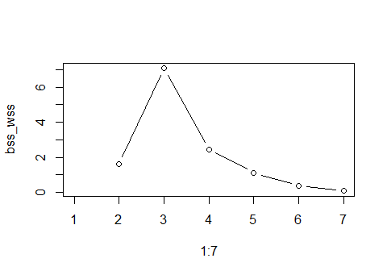

```{r setup, include=FALSE}

rm(list = ls())

library(ggplot2)
library(latex2exp)
library(tidyverse)

library(PMA)
library(pls)
library(MASS)
library(glmnet)
library(ROCR)

knitr::opts_chunk$set(echo = TRUE, fig.width=6, fig.height=4)

set.seed(321)
```

```{r load data, eval=TRUE, include=TRUE}
load('RejectionStatus.rda')
load('X_GSE21374.rda')
dim(RejectionStatus)
dim(X_GSE21374)

GeneExpression <- scale(t(X_GSE21374))

GeneExpression <-
  GeneExpression[order(as.numeric(row.names(GeneExpression))), ]
RejectionStatus <-
  RejectionStatus[order(as.numeric(RejectionStatus$Patient_ID)), ]

all.equal(row.names(GeneExpression), as.character(RejectionStatus$Patient_ID))
```

# Introduction

The data is loaded as presented in the assignment.

Three research questions are defined:

* How do the 54675 genes vary in terms of their gene expression levels? Is the variability associated with kidney rejection? (only to be answered in a data explorative manner).
* Which genes are differentially expressed between the two kidney rejection groups? You must control the False Discovery Rate at 10%.
* Can the kidney rejection be predicted from the gene expressions? What genes are most important in predicting the kidney transplant rejection? How well does the prediction model perform in terms of predicting rejection status?

# Data exploration

In the complete dataset, `r round(mean(RejectionStatus$Reject_Status) * 100) ` % of the transplanted kidnesy were rejected.

## Sparse principle components analysis

```{r}
Gen_spc <- PMA::SPC(GeneExpression, K = 2, sumabsv = 2)
Uk <- Gen_spc$u ; Dk <- diag(Gen_spc$d)
Zk <- data.frame(X = Uk %*% Dk, Patient_ID = row.names(GeneExpression))
Zk <- merge(Zk, RejectionStatus, by = 'Patient_ID') %>% 
  mutate(Reject_Status = as.factor(Reject_Status))
ggplot(data = Zk, aes(x = X.1, y = X.2, col = Reject_Status)) + 
  geom_point()

rm(Zk, Dk, Uk, X_GSE21374, Gen_spc)
```

Unfortunately, naive sparce principle component analysis does not seem to work well.

## Partial least squares:

```{r}
GeneExpression_comb <-
  list(genes = as.matrix(GeneExpression), Rejection = as.matrix(RejectionStatus$Reject_Status))
pls_model <- pls::plsr(genes ~ Rejection, data = GeneExpression_comb, validation = "CV")
```

## Multi-dimensional scaling:

```{r}
GeneExpression.svd <- svd(GeneExpression)

k <-5
Uk <- GeneExpression.svd$u[,1:k]; Dk <- diag(GeneExpression.svd$d[1:k]) 
Vk <-GeneExpression.svd$v[,1:k]
Xk <- Uk %*% Dk %*% t(Vk)
Zk <- Uk %*% Dk

rownames(Zk) <- RejectionStatus[[2]]
rownames(Vk) <- colnames(GeneExpression)
ColnamesNull <- colnames(GeneExpression)
ColnamesNull[]<- "" 

biplot(Uk[,c(1,2)], Vk[,c(1,2)], xlabs=RejectionStatus[[2]], var.axes=FALSE, ylabs=ColnamesNull, cex=0.75)
```

In the biplot of the two first dimensions of the svd, no distinction can be made between rejected and accepted kidneys. The variable arrows are left out of the biplot to have a clear plot.
Biplots of higher dimensions (k=5) are shown below:

```{r}
biplot(Uk[,c(2,3)], Vk[,c(2,3)], xlabs=RejectionStatus[[2]], 
       var.axes=FALSE, ylabs=ColnamesNull, cex=0.75)
biplot(Uk[,c(3,4)], Vk[,c(3,4)], xlabs=RejectionStatus[[2]], 
       var.axes=FALSE, ylabs=ColnamesNull, cex=0.75)
biplot(Uk[,c(4,5)], Vk[,c(4,5)], xlabs=RejectionStatus[[2]], 
       var.axes=FALSE, ylabs=ColnamesNull, cex=0.75)
biplot(Uk[,c(1,3)], Vk[,c(1,3)], xlabs=RejectionStatus[[2]], 
       var.axes=FALSE, ylabs=ColnamesNull, cex=0.75)
```
No distinction between rejected and eccepted kidneys can be made on biplots of higher dimensions either.

```{r}
totvar <- sum(GeneExpression.svd$d^2)/(nrow(GeneExpression)-1)
plot(GeneExpression.svd$d^2/(nrow(GeneExpression)-1), type="b", 
     ylab="eigenvalue",xlab="j",cex=2, cex.axis=1.5, cex.lab=1.5)
barplot(GeneExpression.svd$d^2/(nrow(GeneExpression)-1)/totvar, 
        names.arg=1:nrow(GeneExpression), xlab='j', cex.lab=2)
barplot(cumsum(GeneExpression.svd$d^2/(nrow(GeneExpression)-1)/totvar), names.arg=1:nrow(GeneExpression), ylab='cumulative prop. of total variance')
```

In the scree plots above it can be seen that the two first dimensions account for only 26% of the total variance in the dataset, and the first five dimensions for about 36%.

## LDA

In an exploratory fashion, we look at the results of an LDA, performed with the first 300 gene expressions. We chose to do this because LDA performed using all gene expressions did not work.

```{r}
GeneExpression.lda <- lda(GeneExpression[,1:300], grouping = RejectionStatus$Reject_Status)

V <- GeneExpression.lda$scaling
Z <- GeneExpression[,1:300] %*% V

plot(Z, col =  RejectionStatus$Reject_Status+1, pch= 16, cex = 1.5)

```

We can see a clear distinction between the 2 rejection status groups.

```{r}
plot(V, cex = 0.8, cex.axis = 1.5, cex.lab = 1.5, xlab = "gene ID",
     ylab = "loading")

abline(h=0)
abline(h=c(2,-2)*sd(V), col = 2)

id <- which(abs(V) > 2*sd(V))
```

The most contributing gene expressions are:

```{r}
colnames(GeneExpression[,id])
```

We repeated this for 243 folds of 225 gene expressions because

```{r}
243 * 225 == dim(GeneExpression)[2]
```

```{r}
id.all <- vector("numeric")

for (i in 1:(dim(GeneExpression)[2]/225)){

  start <- 1 + (i-1)*225
  stop <- start + 224
  gene.lda <- lda(GeneExpression[,start:stop], grouping = RejectionStatus$Reject_Status)

  V <- gene.lda$scaling
  Z <- GeneExpression[,start:stop] %*% V


  id.all <- append(id.all, which(abs(V) > 3*sd(V)) - 1 + start) # -1 to start at 0

}
gene.lda <- lda(GeneExpression[,id.all], grouping = RejectionStatus$Reject_Status)

V <- gene.lda$scaling
Z <- GeneExpression[,id.all] %*% V
plot(Z, col =  RejectionStatus$Reject_Status+1, pch= 16, cex = 1.5)

```

```{r}
plot(V, cex = 0.8, cex.axis = 1.5, cex.lab = 1.5, xlab = "gene ID",
     ylab = "loading")

abline(h=0)
abline(h=c(2,-2)*sd(V), col = 2)

id <- which(abs(V) > 2*sd(V))

colnames(GeneExpression[,id.all][,id])
```


Capping off at +- 3SD, this resulted in `r length(id.all)` gene expressions.

Using all these, and only these gene expressions, an LDA delivers `r dim(GeneExpression[,id.all][,id])[2]` genes.

Why at 3SD? PAS OP UITVOEREN DUURT LANG, in plaats daarvan, zie plot in de map

```{r, eval=FALSE}
id.all <- vector("numeric")
bss_wss <- vector("numeric")
p <- vector("numeric")

for(j in 2:8){
  id.all <- vector("numeric")
for (i in 1:(dim(gene)[2]/225)){

  start <- 1 + (i-1)*225
  stop <- start + 224
  gene.lda <- lda(gene[,start:stop], grouping = RejectionStatus$Reject_Status)

  V <- gene.lda$scaling
  Z <- gene[,start:stop] %*% V


  id.all <- append(id.all, which(abs(V) > j*sd(V)) - 1 + start) # -1 to start at 0

}

gene.lda <- lda(gene[,id.all], grouping = RejectionStatus$Reject_Status)

V <- gene.lda$scaling
Z <- gene[,id.all] %*% V

a <- sum((Z[RejectionStatus$Reject_Status==1] - mean(Z[RejectionStatus$Reject_Status==1]))**2)
b <- sum((Z[RejectionStatus$Reject_Status==0] - mean(Z[RejectionStatus$Reject_Status==0]))**2)

within <- a+b


a <- sum((mean(Z[RejectionStatus$Reject_Status==0])-mean(Z))**2)
b <- sum((mean(Z[RejectionStatus$Reject_Status==1])-mean(Z))**2)
between <- a*sum(RejectionStatus$Reject_Status==0)+b*sum(RejectionStatus$Reject_Status==1)

bss_wss[j] <- between/within
p[j] <- length(id.all)
}

plot(1:7, bss_wss, "b")
```


```{r}

```


# Differentiating genes between kidney acceptance and rejection

# Prediction of kidney transplant rejection

```{r}
ind_train <-
  sample(seq_len(nrow(RejectionStatus)), size = floor(nrow(RejectionStatus) * 0.80))

Y_train <- as.matrix(RejectionStatus[ind_train, 'Reject_Status'])
X_train <- as.matrix(GeneExpression[ind_train,])
Y_test <- as.matrix(RejectionStatus[-ind_train, 'Reject_Status'])
X_test <- as.matrix(GeneExpression[-ind_train,])
```


## Lasso regression

```{r}
m.cv <-
  cv.glmnet(
    x = X_train,
    y = Y_train,
    alpha = 1,
    family = 'binomial',
    type.measure = "auc"
  )
plot(m.cv, xlab = TeX(" $ log(\\gamma ) $ "))
```

In the figure above, one can see that for $\gamma$ equal to   `r m.cv$lambda.min`  , the area under the curve ( _AUC_ ) is maximal for the train dataset based on a 10-fold cross-validation over the train dataset. 

The ROC curve, estimated with the cross-validation dataset, is shown below:

```{r}
m <- glmnet(
  x = X_train,
  y = Y_train,
  alpha = 1,
  family = 'binomial',
  lambda = m.cv$lambda.min
)
pred_m <-
  prediction(predict(
    m,
    newx = X_test,
    type = 'response'
  ),
  Y_test)
perf <- performance(pred_m, 'sens', 'fpr')
plot(perf)
```

This model uses 
`r length(unique(summary(coef(m))[-1,1])) ` 
of the features. 
This is a considerable dimensional reduction.
This is illustrated below. This figure shows the loadings of the 
`r length(unique(summary(coef(m))[-1,1])) ` 
selected values.

```{r, fig.width=4, fig.height=3.5, eval=TRUE, echo=FALSE}
plot(
  summary(coef(m))[-1, 1],
  summary(coef(m))[-1, 3],
  cex = 1,
  pch = 3,
  xlab = 'feature' ,
  ylab = TeX(" $ \\hat{\\beta} $ ")
)
```


## Ridge regression

```{r}
m.cv <-
  cv.glmnet(
    x = X_train,
    y = Y_train,
    alpha = 0,
    family = 'binomial',
    type.measure = "auc"
  )
plot(m.cv, xlab = TeX(" $ log(\\gamma ) $ "))
```

In the figure above, one can see that for $\gamma$ equal to   `r m.cv$lambda.min`  , the area under the curve ( _AUC_ ) is maximal for the train dataset based on a 10-fold cross-validation over the train dataset. 

The ROC curve, estimated with the cross-validation dataset, is shown below:

```{r}
m <- glmnet(
  x = X_train,
  y = Y_train,
  alpha = 0,
  family = 'binomial',
  lambda = m.cv$lambda.min
)
pred_m <-
  prediction(predict(
    m,
    newx = X_test,
    type = 'response'
  ),
  Y_test)
perf <- performance(pred_m, 'sens', 'fpr')
plot(perf)
```


